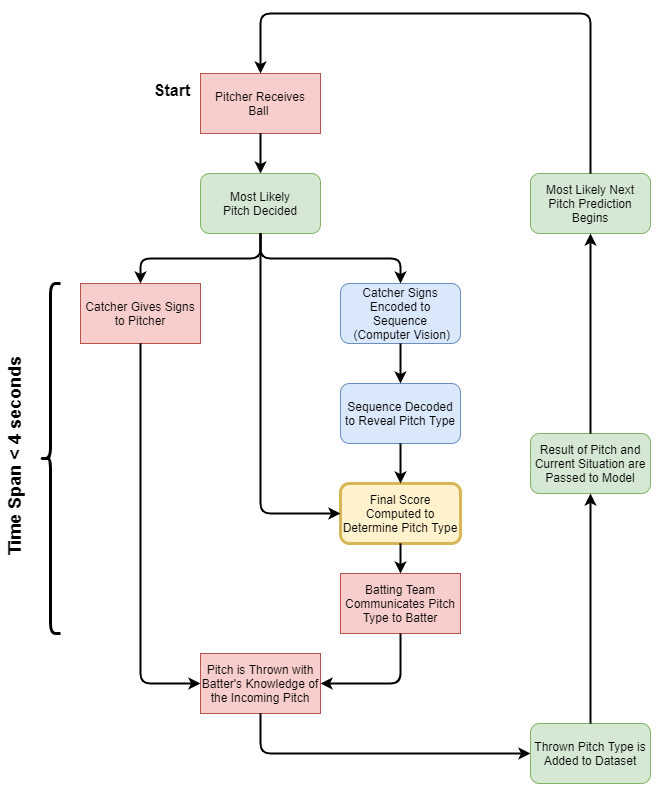

# Redesigning the Houston Astros Cheating Scandal

## Intro
Throughout the 2017 Major League Baseball season, the Houston Astros used a camera in center field to track and decode the signs given by the opposing team's catcher.
These signs are used to communicate with the pitcher what pitch to throw whether it be a fastball, curveball, change-up, etc. and are given in the form of number sequences.
For example, the catcher may show the pitcher the numbers 2-4-3-1-2, which the pitcher would interpret using some decoding rule to throw the corresponding pitch. The Astros decoded
these number sequences in real time and relayed what pitch was coming to their hitters by banging on trash-cans in the dugout, giving them a significant advantage as they
were 93% accurate in determining off-speed pitches.

Linked [here](https://www.youtube.com/watch?v=M2XNW1qHN9w) (slight language warning) is an excellent and brief breakdown of these events taking place.

## Project Goals
The primary objective of this project is to test the limits of Computer Vision, Neural Networks, and Data Analysis in order to automate and possibly improve the decoding process
done by the Astros.

More importantly this project is an opportunity to gain the experience in:
1. Creating an end-to-end series of both effective and efficient models
2. Utilizing Computer Vision technologies
3. Generating/Analyzing large data-sets
4. Determining an Optimal Score Function

## Workflow

The following 3 models will be implemented using the flowchart below in order to achieve the goals of project

1. Computer Vision Model (***Blue Part 1***)
    - Encoding catcher finger's to a sequence of numbers
2. Recurrent Neural Network (***Blue Part 2***)
    - Decoding sequence of numbers to the type of pitch (fastball or off-speed)
3. Next-Pitch Prediction (***Green***)
    - Finding most probable pitch a pitcher would throw given a certain scenerio (count, outs, handedness, base-runners, etc.)

## ✅ Completed Parts
✅ Tensorflow RNN that is able to decode variable length signs

✅ Generate data-sets/labels for RNN that follow encoding patterns and MLB trends

 ## 🚧 WIP
🚧 OpenCV and Mediapipe Model to identify catcher fingers

🚧 Web-scraper to collect large amounts of pitching data from various pitchers

🚧 Model to interpret web-scraped data

🚧 All-in-one GUI to display inputs/outputs and predicted pitch types

🚧 Score function to weigh RNN Prediction and Data Analysis Prediction

## Relevant Resources
[1] [A Mathematical Analysis of Catcher/Pitcher Encryption Schemes](https://courses.csail.mit.edu/6.857/2018/project/mlancast-samird-mtwu-Baseball.pdf)

[2] [Sign Stealing Scandal Data Visualizations](http://signstealingscandal.com/)

[3] [The Most Important Bangs of the Astros' Scheme](https://blogs.fangraphs.com/the-most-important-bangs-of-the-astros-scheme/)
